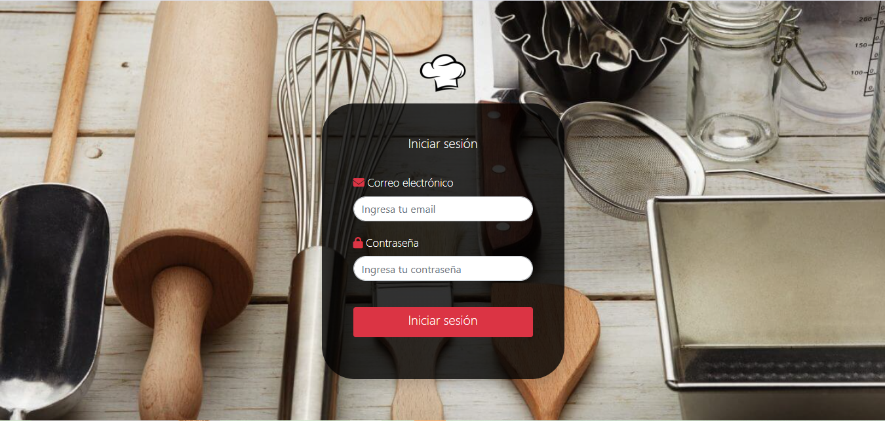
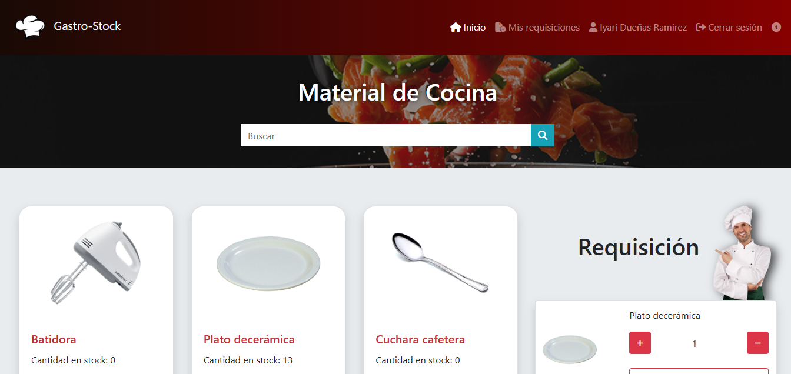
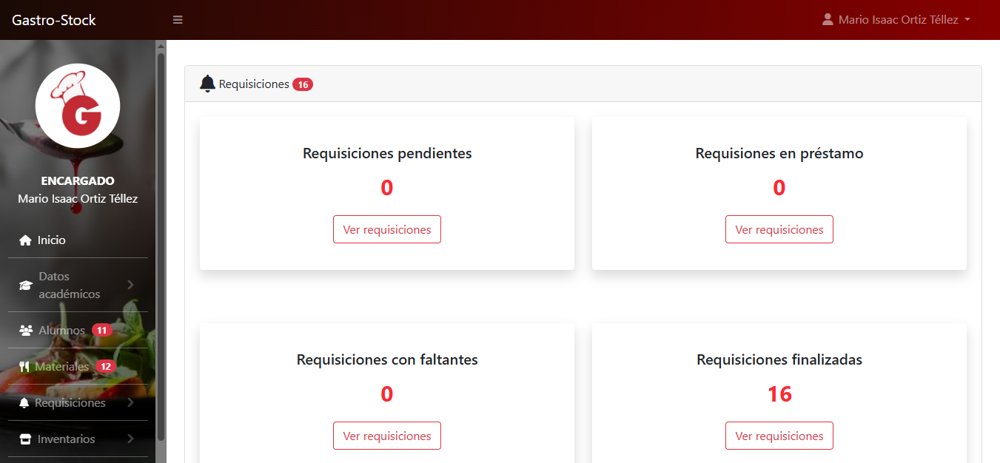
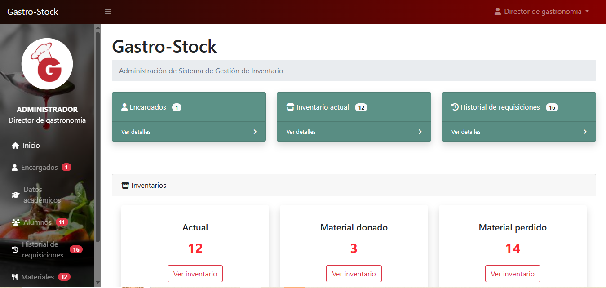

# GastroStock

Proyecto escolar desarrollado para la gestión de inventarios y requisiciones para la carrera de gastronomia de la Universidad Tecnológica de la Costa Grande de Guerrero.

El sistema Web GastroStock cuenta con tres tipos de usuarios: administrador, encargado de almacen de gastronomía y alumno.

Fue desarrollado con HTML, CSS, DataTables, JS, además del uso del framework Bootstrap.

[Proyecto en línea](https://www.gastrostock.site/)

- Capturas de pantalla

## Usuario Alumno

## Usuario Encargado

## Usuario Administrador

- Tecnologías

* HTML
* CSS
* JavaScript
* Bootstrap 
* DataTables

- Rol: Programador
- Fecha de realización: 2024
